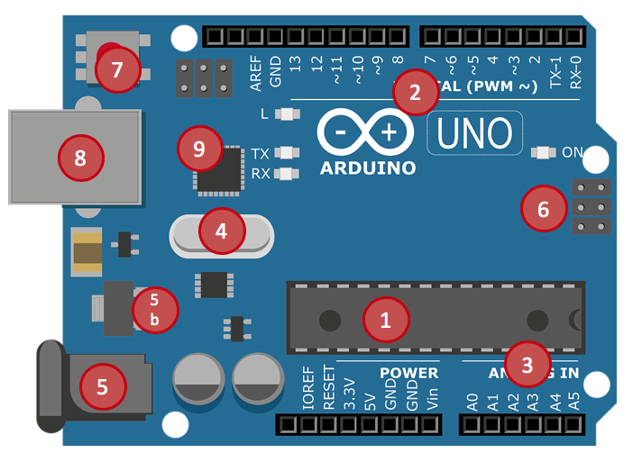

# ARDUINO

## COS'E' ARDUINO

Arduino è una piattaforma open-source di prototipazione elettronica basata su hardware e software flessibili e facili da usare. È progettato per consentire a persone con competenze tecniche varie, compresi i principianti, di creare progetti interattivi e dispositivi elettronici. La piattaforma include una scheda di sviluppo, chiamata "Arduino board", che può essere programmata attraverso un linguaggio di programmazione derivato da C/C++.

Le schede Arduino sono dotate di ingressi e uscite digitali e analogiche che consentono agli utenti di collegare sensori, attuatori e altri componenti elettronici. La comunità di Arduino ha sviluppato una vasta gamma di librerie e shields (schede di espansione) per semplificare la creazione di progetti, rendendo Arduino una scelta popolare per gli hobbisti, gli studenti e gli appassionati di elettronica.

## COMPONENTI HARDWARE
Arduino UNO è una piattaforma HW dotata di Microcontrollore ATMega328P

1. **MICROCONTROLLORE**. È un microcontrollore a 8 bit, in formato PDIP a 28 pin. L’MCU è dotata di 3 differenti tipologie di memoria: FLASH 32 KB (che includono anche il bootloader e la memoria programma), SRAM 2 KB (usata per memorizzare le variabili e le costanti del software) ed EEPROM 1KB (utilizzata per memorizzare le configurazioni).
2. **PIN DIGITALI**. Un totale di 14 pin di input/output digitali programmabili, di cui 6 utilizzabili per fornire in uscita segnali modulati PWM (~).
3. **PIN ANALOGICI**. Un totale di 6 pin di input analogici.
4. **OSCILLATORE**. Oscillatore a frequenza.
5. **ALIMENTAZIONE**. Jack per alimentazione esterna (5b: Regolatore di tensione).
6. **ICSP**. Connettore ICSP (In Circuit Serial Programmer) per effettuare la programmazione diretta del microcontrollore.
7. **RESET**. Pulsante di Reset.
8. **CONNETTORE USB**. Connettore USB utilizzabile sia per alimentare la scheda che per programmare il microcontrollore.
9. **COMUNICAZIONE**. Dispositivo per la comunicazione 16U2, si occupa della conversione dei dati provenienti dall’USB in dati seriali (e viceversa).

## IDE

Nell'IDE, scrivi il tuo programma utilizzando il linguaggio di programmazione di Arduino, che è essenzialmente una variante semplificata di C/C++.

Il codice Arduino è suddiviso in due funzioni principali:

* `void setup():` Questa funzione viene eseguita una sola volta all'avvio della scheda Arduino. In questa funzione, puoi eseguire le impostazioni iniziali, come configurare le porte di I/O.
* `void loop():` Questa funzione viene eseguita ripetutamente finché la scheda Arduino è accesa. In questa funzione, puoi inserire il codice che vuoi che la scheda Arduino esegua.

